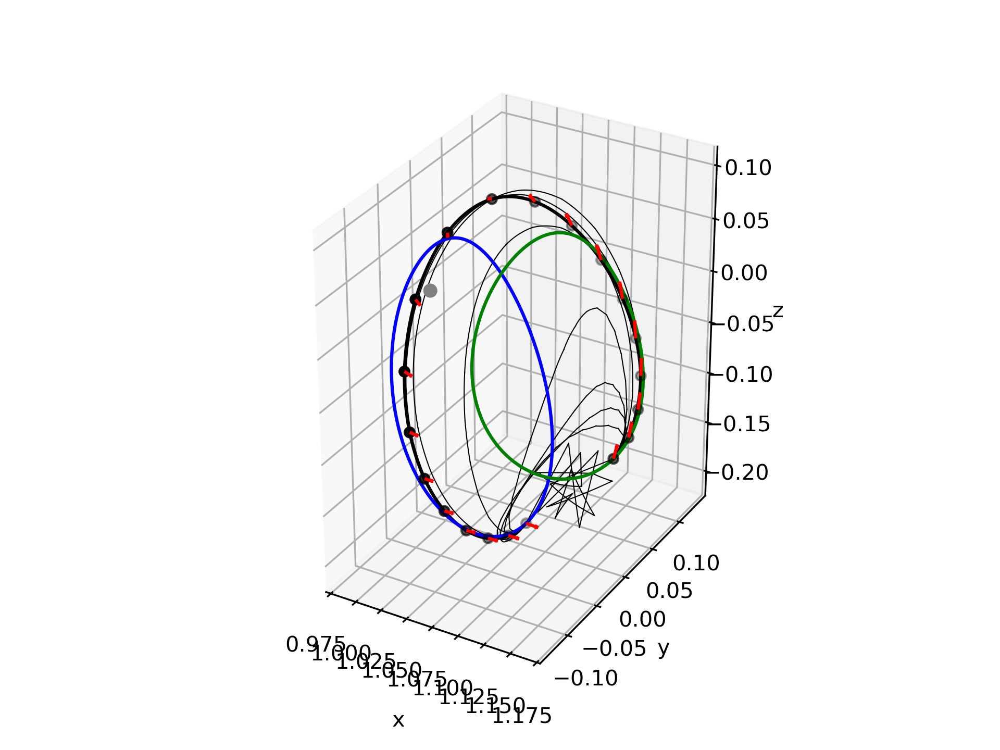

# stardust

> The Initial Guess is Random Noise

 

Stardust is a suite of two-stage optimization scheme for trajectory design in Newtonian dynamics [1]. 

The scheme makes use of the following assumptions:
- the control actions are discretized to $N$ points, and are assumed to be impulsive (i.e. instantaneous change in velocity)

The speed of the algorithm is dependent on $N$, since there is a Jacobian to be computed & least-squares problem with sizes that scale linearly with $N$. 
In practice, $N = 30 \sim 50$ is "manageable" (solves in the order of 10s of seconds using RK4). 


## Quick start

1. Clone this repository and `cd` to its root

2. Make sure the local python environemnt has dependencies: `cvxpy`, `numpy`, `scipy`, `matplotlib`, `numba`

3. Run tests with `pytest`

```bash
pytest tests
```

## How to use `stardust`

The package provides the following dynamics models:

- CR3BP (`stardust.eom_rotating_cr3bp`/`stardust.eom_stm_rotating_cr3bp`)

If you want to use your own dynamics model, the only thing you need to implement is the dynamics function, which computes the state and state-transition matrix (STM) derivatives. The function should have the following signature:

```python
def eom_stm(t, x_stm, *args):
    # unpack state and STM
    x = x_stm[:nx]                                        # state
    STM = x_stm[nx:].reshape(nx,nx)                       # STM

    # compute eom & store into 1D array to be returned
    deriv_x_stm = np.zeros(nx + nx*nx,)
    deriv_x_stm[:nx] = ...                                # state-derivative
    deriv_x_stm[nx:] = (Jacobian @ STM).reshape(nx*nx,)   # STM derivatives
    return deriv_x_stm
```

where `nx` is the dimension of the state. 

And... that's it! 
Let's now consider a problem, where we will use the provided CR3BP dynamics. 

```python
# system constants
mu = 1.215058560962404e-02
mu1 = 1 - mu
mu2 = mu

# initial state
rv0 = np.array([1.0809931218390707E+00,
      0.0000000000000000E+00,
      -2.0235953267405354E-01,
      1.0157158264396639E-14,
      -1.9895001215078018E-01,
      7.2218178975912707E-15])
period_0 = 2.3538670417546639E+00
sol0_ballistic = solve_ivp(stardust.eom_rotating_cr3bp, (0, period_0), rv0,
                           args=(mu, mu1, mu2), 
                           method='RK45', rtol=1e-12, atol=1e-12)

# final targeted state
rvf = np.array([1.1648780946517576,
                0.0,
                -1.1145303634437023E-1,
                0.0,
                -2.0191923237095796E-1,
                0.0])
period_f = 3.3031221822879884
solf_ballistic = solve_ivp(stardust.eom_rotating_cr3bp, (0, period_f), rvf,
                           args=(mu, mu1, mu2), 
                           method='RK45', rtol=1e-12, atol=1e-12)

# construct problem
args = (mu, mu1, mu2)       # arguments for the equations of motion
tspan = [0, 1.2*period_0]   # transfer time
N = 20                      # number of nodes
prob = stardust.FixedTimeTwoStageLeastSquares(
    stardust.eom_stm_rotating_cr3bp,
    rv0,
    rvf,
    tspan,
    N = N,
    args = args,
)

# solve the problem
tstart = time.time()
exitflag, iter_sols = prob.solve(maxiter = 10, save_all_iter_sols = True, verbose_inner = True)
tend = time.time()

# plot trajectory
fig, ax, sols_check = prob.plot_trajectory(use_itm_nodes=False, show_maneuvers=True)

# some assertions to make sure we've arrived at the final state targeted
pos_error = np.linalg.norm(sols_check[-1].y[0:3,-1] - rvf[0:3])
vel_error = np.linalg.norm(sols_check[-1].y[3:6,-1] + prob.v_residuals[-1] - rvf[3:])
print(f"Final position error = {pos_error}")
print(f"Final velocity error = {vel_error}")
assert pos_error < 1e-11
assert vel_error < 1e-11

# also plot iterates
for _sols in iter_sols:
    for _sol in _sols:
        ax.plot(_sol.y[0,:], _sol.y[1,:], _sol.y[2,:], color='black', lw=0.5)
ax.plot(sol0_ballistic.y[0,:], sol0_ballistic.y[1,:], sol0_ballistic.y[2,:], color='blue')
ax.plot(solf_ballistic.y[0,:], solf_ballistic.y[1,:], solf_ballistic.y[2,:], color='green')
stardust.plot_sphere_wireframe(ax, 1737/384400, [1-mu,0,0], color='grey')
ax.set(xlabel="x", ylabel="y", zlabel="z")
ax.set_aspect('equal', 'box')
```

<p align="center">
  
</p>


## TODO

- [x] Sparse Jacobian approximation
- [x] Storage for best solution so far
- [ ] Parallelization
  - [ ] Sparse Jacobian calculation
- [ ] Two-body dynamics
- [ ] Option to neglect initial and/or final maneuver cost (weighted least-squares)
- [ ] Sensitivity of least-squares problem to speed up Jacobian?


## References

[1] N. L. Parrish, “Low Thrust Trajectory Optimization in Cislunar and Translunar Space,” University of Colorado, 2018.
